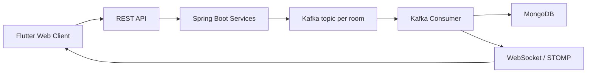

# VRATA

Distributed room-based chat application built with Flutter, Spring Boot, Kafka, MongoDB, and WebSocket/STOMP.

- Live Application: [messenger-dnp.github.io](https://messenger-dnp.github.io/)
- Demo Video: [Google Drive](https://drive.google.com/drive/folders/1gL7EZCs8ooNubmVKkBrMVyvZSlgxeB8u?usp=sharing)

## Project Proposal

VRATA is a distributed messenger designed as a real-time network programming project. The main goal is to build a chat system where multiple users can create rooms, join by invite code, exchange messages in real time, and keep communication isolated between rooms.

The project follows assignment Variant B: each chat room is mapped to a separate Kafka topic, and users receive messages only from the room they joined. This approach keeps the design simple, makes message routing explicit, and ensures room-level isolation without additional filtering logic.

## Scope

- User registration and login
- Room creation and joining by invite code
- Room-based real-time messaging
- Persistent message history
- Kafka-backed asynchronous message delivery
- WebSocket/STOMP live updates for connected clients

## Architecture

The system consists of two main applications:

- `frontend` - a Flutter web client for authentication, room management, and chat UI
- `backend` - a Spring Boot service that exposes REST endpoints, manages rooms, publishes messages to Kafka, stores history in MongoDB, and delivers live updates over WebSocket/STOMP

Message flow:



The backend uses a layered architecture:

- `api` - controllers, DTOs, transport configuration
- `domain` - business logic and repository interfaces
- `infrastructure` - MongoDB, Kafka, and WebSocket integrations

The frontend uses a feature-first layered architecture:

- `presentation` - screens, widgets, controllers
- `domain` - entities, use cases, repository contracts
- `data` - remote datasources, DTOs, mappers, repository implementations

## Tech Stack

- Frontend: Flutter, Riverpod, REST API, WebSocket/STOMP
- Backend: Java 17, Spring Boot, Spring Web, Spring Kafka, Spring Data MongoDB, Spring WebSocket
- Data and messaging: MongoDB, Apache Kafka
- Infrastructure: Docker Compose, Maven Wrapper, Flutter tooling

## Repository Structure

```text
.
├── backend/    Spring Boot backend service
├── frontend/   Flutter web client
├── docker-compose.yaml
└── Makefile
```

## Local Setup

### Full project with Docker

From the repository root:

```bash
make up
```

Run in detached mode:

```bash
make upd
```

Stop the environment:

```bash
make down
```

Useful commands:

```bash
make logs
make logs-f
make ps
```

### Run modules separately

Backend:

```bash
cd backend
make run
make build
```

Frontend:

```bash
cd frontend
make pub-get
make run
```

The frontend expects the backend at `http://localhost:8080` by default.

## Documentation

- Backend README: [backend/README.md](/Users/vika/IdeaProjects/VRATA/backend/README.md)
- Backend API specification: [backend/api.yaml](/Users/vika/IdeaProjects/VRATA/backend/api.yaml)

## Validation

The project was validated with API testing, frontend interaction, and Kafka producer/consumer logs. Based on the report, the system demonstrates:

- room-level message isolation
- real-time message delivery through WebSocket/STOMP
- message persistence in MongoDB
- dynamic Kafka topic creation for chat rooms

## Team

- Arsen Latipov - frontend
- Adeliya Nagimova - backend, Kafka producer, report
- Rolan Muliukin - backend, core logic, deployment
- Timur Bikmetov - DevOps, deployment
- Victoriia Gorbacheva - backend, Kafka consumer, report, presentation
