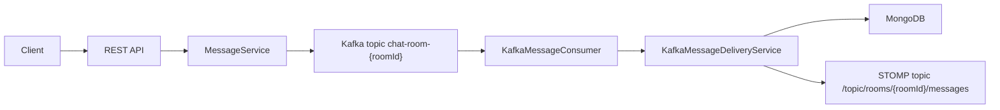

# VRATA Backend

Backend for the VRATA chat service. It is responsible for user authentication, room creation and joining, message delivery, message history storage, and real-time updates.

## Tech Stack

- Java 17
- Spring Boot
- Spring Web
- Spring Validation
- Spring WebSocket + STOMP
- Spring Kafka
- Spring Data MongoDB
- MongoDB
- Apache Kafka
- Maven Wrapper
- Docker Compose

## API

API specification: [api.yaml](/Users/vika/IdeaProjects/VRATA/backend/api.yaml)

## General Architecture

The backend is split into three layers:

- `api` - REST controllers, DTOs, and HTTP/WebSocket configuration
- `domain` - business logic, domain models, and repository interfaces
- `infrastructure` - MongoDB, Kafka, WebSocket publisher, and migrations

Main message delivery flow:



Flow by steps:

1. The client sends a message through the REST API.
2. The backend validates the request and publishes the message to the room Kafka topic.
3. A Kafka consumer reads the event.
4. The delivery service stores the message in MongoDB.
5. The message is pushed to room subscribers over WebSocket/STOMP.

## Local Run

### macOS

Full local environment from the project root:

```bash
make up
```

Detached mode:

```bash
make upd
```

Stop the environment:

```bash
make down
```

Run the backend module directly:

```bash
cd backend
make run
```

Build and test the backend module:

```bash
cd backend
make build
make linux-test
```

### Linux

Full local environment from the project root:

```bash
make up
```

Detached mode:

```bash
make upd
```

Stop the environment:

```bash
make down
```

Run the backend module directly:

```bash
cd backend
make run
```

Build and test the backend module:

```bash
cd backend
make build
make linux-test
```

### Windows

If you use Git Bash, WSL, or another shell with GNU Make available, run the project from the repository root with:

```bash
make up
```

Detached mode:

```bash
make upd
```

Stop the environment:

```bash
make down
```

To build or run the backend from a Unix-like shell on Windows:

```bash
cd backend
make run
make build
```

For backend tests in a native Windows environment:

```powershell
cd backend
make windows-test
```

### Local Services

- backend: `http://localhost:8080`
- frontend: `http://localhost:3000`
- kafka-ui: `http://localhost:8081`

### Requirements

- JDK 17
- Docker + Docker Compose
- GNU Make

### Useful commands

```bash
make logs
make logs-f
make ps
```

